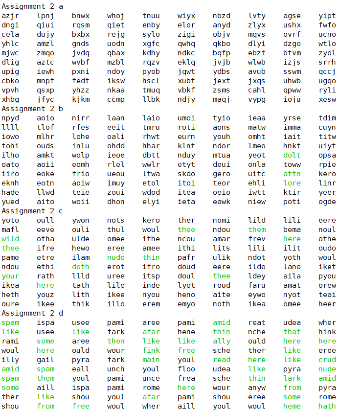
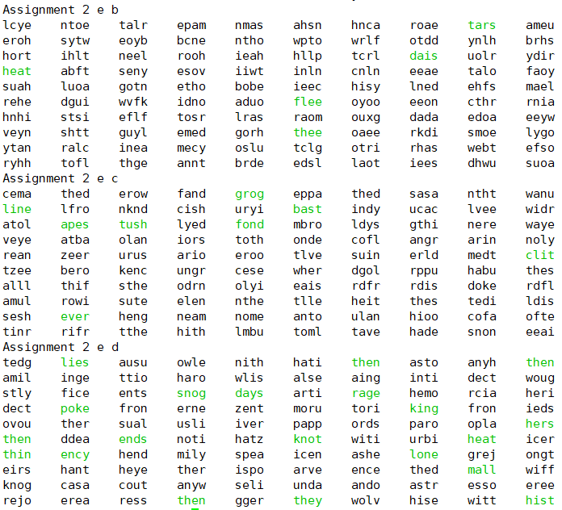

# Solutions For Graphical Models Assignment 2-2

#### Description
```
Markov word generator
```

#### Installation
```
sudo apt install python-enchant
pip3 install pyenchant
```

#### Usage:
```
python3 main.py
```

#### Result
```
All valid english words will be printed in green color.
```



